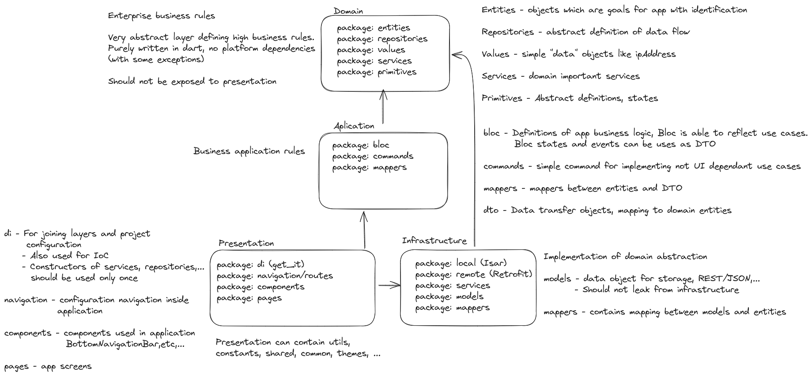

# 3D Printer monitoring

This is just for fun project to learn flutter and clean architecture with DDD in mind. I want to
create simple application to monitor 3D printer status.

## Task

Application for basic 3D printer status monitoring. Splitted into two stages of development. 3D
printer status will be visualized in simple gauge.

Status will show:

- Is printing and other status
- % of current job
- temperatures for bed a nozzle
- Printer name
- Job name
- ETA

### 1. Stage

Monitoring just one 3d printer. Status will be refreshed by button event

#### Use-cases

- User can add printer
- User can remove printer
- User can refresh status

### 2. Stage

- Monitoring multiple 3d printer.
- Information will be automatically updated.
- Printers will be shown in 2x5 grid - limit to max 10 printers

#### Use-cases

Some use cases will be added in future.

- Use-cases from stage 1
- User can select witch printer wont to edit
- User can select witch printer wont to delete

---

## Arch drawing

